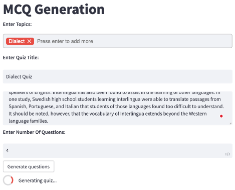
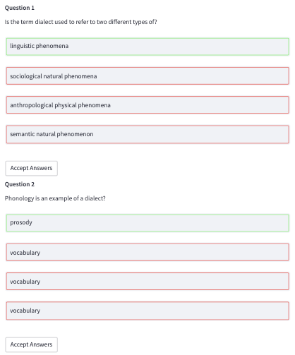
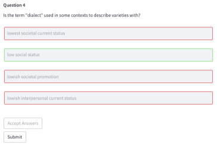
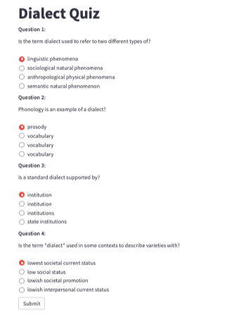
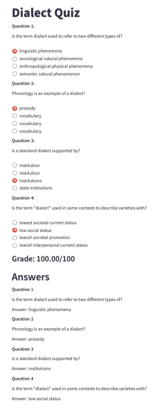

# MCQ-Generation

Quizzes are frequently used for learning and assessments in educational settings.
However, creating quizzes manually is a time-consuming and tedious process.
We attempted to create a system that automatically generates multiple-choice
questions (MCQs) from a long passage of text. Our system also allows quality
control and provides an interface to solve the quiz.

## Installation

Run the commands below on the terminal

```bash
git clone https://github.com/hatsumikana/MCQ-Generation.git
cd MCQ-Generation
pip install -r requirements.txt
python -m spacy download en_core_web_l
```

[Download T5 model weights
t5-small (200MB)](https://sutdapac-my.sharepoint.com/:u:/g/personal/gargi_pandkar_mymail_sutd_edu_sg/EUB9OSuWSi5FmC3Dsl8xs-gBx4zt-ff-lcMJPUAOjsDSqg?e=Kg8JIV)

[Download t5-base (800MB)](https://sutdapac-my.sharepoint.com/:u:/g/personal/gargi_pandkar_mymail_sutd_edu_sg/EUSN9U-s3SZNkVT5YNq4JikBAIYxC7fXAw8-9V9gvaBTkQ?e=RSL2lb)

Place folders as such -> MCQ-Generation/outputs/final

[Download Sense2Vec](https://github.com/explosion/sense2vec/releases/download/v1.0.0/s2v_reddit_2015_md.tar.gz)

Place as such -> MCQ-Generation/s2v_old

After completing the steps provided above, run the command below to launch the application

```bash
streamlit run QuizMaker.py
```

## GUI Demonstration

1. Enter the following:
   - Topic
   - Title of quiz
   - Context to generate questions from
   - Number of questions to generate
2. Click Generate and wait for 2-3mins depending on how many questions are being generated



3. Check through the answers for the questions and edit if required
   - Box with green border indicates the correct answer
   - Box with red border indicates the wrong answers



4. Click accept answers for every question. Once accept answers button is clicked, user will not be able to amend the answers.
5. Click submit to save the quiz into a .csv file



6. Move to the Quiz tab on the sidebar


7. Browse for the quiz file that had been generated


8. User will be able to review the quiz 



9. Upon clicking submit, users will be able to see their score and the answers to the questions



## Contributing
1004429	Kanashima Hatsumi	

1004385	Tan Ze Xin Dylan	

1004680	Gargi Pandkar	

1004359	Mihir Chhiber

We would like to thank the faculty for 50.021 Artificial Intelligence at SUTD for guiding us through this project.